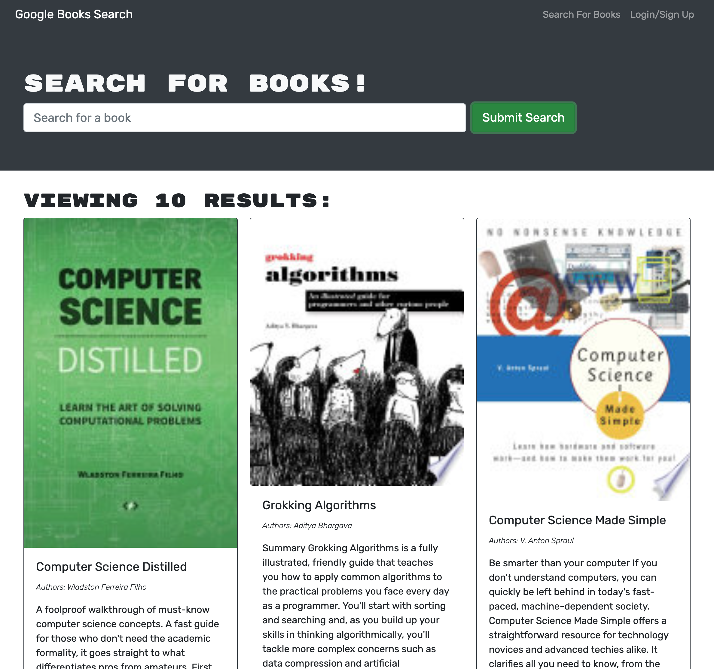
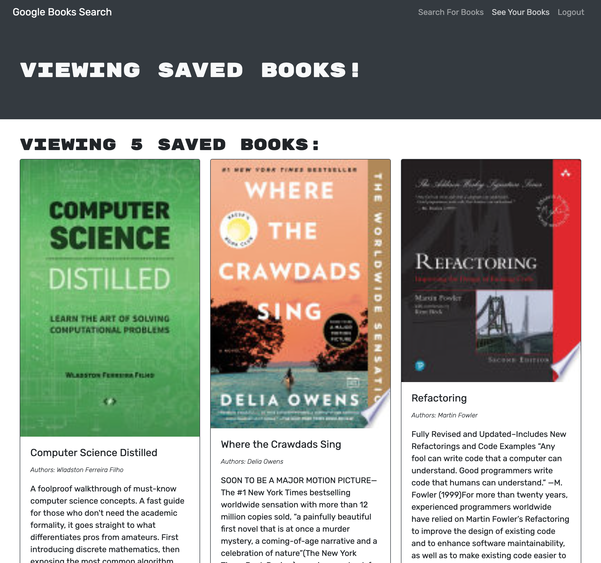

# Big Book Energy
Google Books API search engine built with MERN Stack and GraphQL API

## Description
Given a fully function Google Books API search engine using RESTful APIs, refactor to instead use GraphQL API built with Apollo Server. This application uses React, Apollo Server, MogoDb, and Node.js.

## Table of Contents
* [Usage](#usage)
* [Photo](#photo)
* [License](#license)
* [Contributing](#contributions)
* [Tests](#tests)
* [Questions](#questions)

## Usage
This application is deployed to Heroku and ready to use. 
Search for books by title. 
Sign up of Log in to save books. 
Use the 'See your Books' nav link to view or delete books that you have saved.

## Photo

## License
None

## Contributing
This application is not open-source at this time. Feel free to fork or clone the repo to further develop this application for your own use!

## Tests
No testing required

## Additional Info
* Github: [kalecodes](https://github.com/kalecodes)
* Heroku Deployment: [Big Book Energy](https://big-book-energy.herokuapp.com/)